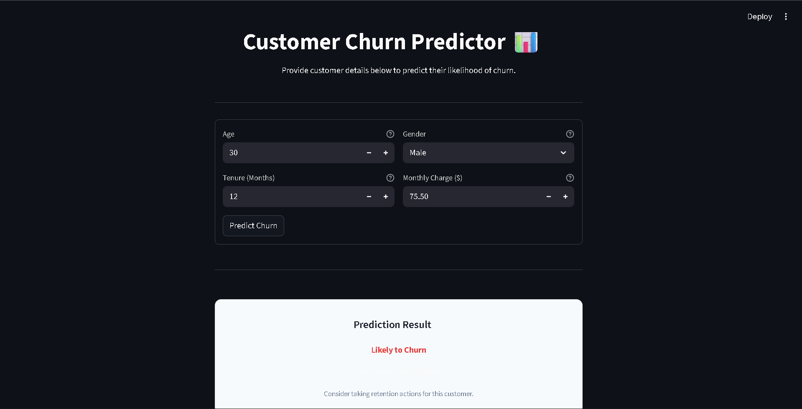

# Customer_Churn_Prediction

Churn refers to the process of losing customers or subscribers and replacing them with new ones.

# Customer Churn Prediction


---

## Table of Contents

- [Description](#description)
- [Features](#features)
- [Tech Stack](#tech-stack)
- [Installation Instructions](#installation-instructions)
- [Usage](#usage)
- [Screenshots or Demo](#screenshots-or-demo)
- [Contributing Guidelines](#contributing-guidelines)
- [License](#license)
- [Contact Information](#contact-information)

---

## Description

Customer Churn Prediction is a machine learning project that predicts which customers are likely to leave a business based on historical data. By analyzing customer behavior and patterns, this tool helps companies proactively address retention strategies, reduce churn rates, and optimize business growth.

---

## Features

- Predicts customer churn using advanced machine learning models
- Data preprocessing and feature engineering pipeline
- Model training and evaluation with accuracy metrics
- Visualizations of churn rates and feature importances
- Easy-to-use command-line interface for predictions
- Extensible for different datasets and business domains

---

## Tech Stack

- **Languages:** Python 3.8+
- **Frameworks/Libraries:**
  - pandas
  - numpy
  - scikit-learn
  - matplotlib / seaborn
- **Tools:**
  - Jupyter Notebook
  - Git & GitHub

---

## Installation Instructions

1. **Clone the Repository**

   ```bash
   git clone https://github.com/Tejas-00/Customer_Churn_Prediction.git
   cd Customer_Churn_Prediction
   ```

2. **Create & Activate Virtual Environment**

   ```bash
   python -m venv venv
   source venv/bin/activate  # On Windows: venv\Scripts\activate
   ```

3. **Install Requirements**

   ```bash
   pip install -r requirements.txt
   ```

---

## Usage

1. **Prepare Your Dataset**
   - Place your data file (e.g., `customer_data.csv`) in the project directory.

2. **Run the Jupyter Notebook for Exploration & Training**

   ```bash
   jupyter notebook
   # Open and run 'Churn_Prediction.ipynb'
   ```

3. **Predict Churn from Command Line (if script available)**

   ```bash
   python predict_churn.py --input customer_data.csv
   ```

4. **Evaluate Model**

   - View evaluation metrics and visualizations in the notebook or output directory.

---

## Screenshots or Demo



---

## Contributing Guidelines

We welcome contributions! Please follow these steps:

1. Fork the repository
2. Create a new branch (`git checkout -b feature-name`)
3. Make your changes
4. Commit and push (`git commit -m 'Add feature'`)
5. Submit a pull request

Please read our [CONTRIBUTING.md](CONTRIBUTING.md) for more details.

---

## License

This project is licensed under the [MIT License](LICENSE).

---

## Contact Information

- **GitHub:** [Tejas-00](https://github.com/Tejas-00)
- **LinkedIn:** [Tejas Patil](https://www.linkedin.com/in/tejas-patil-00/)
- **Email:** tejassonawanework@gmail.com

---